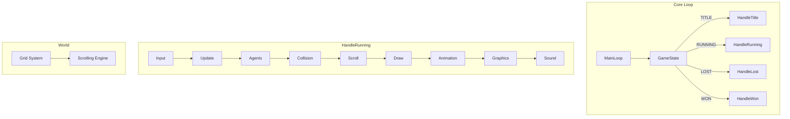

# Catch That Tiger - Game Development Plan

> **For agents:** Consult this file for project context, architecture, and module specifications.

A cat-and-mouse chase game where the player (a cat) catches prey (mice), avoids enemies (humans), and collects cat treats. Built with TypeScript and PixiJS for the browser.

---

## Architecture Overview



---

## Time Management

All game logic runs **frame-based**: movements and animation updates are expressed relative to frames, not wall-clock time. This keeps behaviour consistent and predictable across different machines.

- **Target:** 60 FPS
- **Main loop:** Track elapsed time between frames using `performance.now()`. If the loop runs ahead of 60fps, throttle by waiting (e.g. `requestAnimationFrame` or `setTimeout`/`Promise` with a minimum interval) so each frame takes at least ~16.67ms.
- **Updates:** Each frame = one tick. `update()` is called once per frame with no delta parameter; movement distances (e.g. tiles per frame) and animation advances are fixed per frame.
- **Animation:** Animator advances by game frames, not real time. E.g. "next frame every 4 game frames" for a walk cycle.

---

## Tech Stack

- **TypeScript** - Type-safe game logic
- **PixiJS** - Canvas rendering, sprites, display objects
- **Vite** - Build tool and dev server (recommended for TS + browser)
- **Howler.js** (optional) - Sound playback (PixiJS has no native sound)

---

## Project Structure

```
catch-that-tiger/
├── index.html
├── package.json
├── tsconfig.json
├── vite.config.ts
├── PLAN.md              # This plan - full specification for agents
├── TODO.md               # Progress tracker
└── src/
    ├── main.ts           # Entry point, app bootstrap
    ├── config.ts         # Game constants
    ├── input/
    │   ├── InputManager.ts
    │   └── types.ts
    ├── graphics/
    │   └── Renderer.ts
    ├── animation/
    │   ├── SpritesheetFlyweight.ts
    │   ├── FrameRecord.ts
    │   ├── AnimationDefinition.ts
    │   └── Animator.ts
    ├── sound/
    │   └── SoundManager.ts
    ├── agents/
    │   ├── Agent.ts
    │   ├── AgentFactory.ts
    │   └── types.ts
    ├── grid/
    │   ├── Grid.ts
    │   ├── Tile.ts
    │   └── types.ts
    ├── collision/
    │   ├── CollisionDetector.ts
    │   └── types.ts
    ├── scroll/
    │   └── ScrollEngine.ts
    └── game/
        ├── GameLoop.ts
        ├── GameState.ts
        └── handlers/
            ├── handleTitle.ts
            ├── handleRunning.ts
            ├── handleLost.ts
            └── handleWon.ts
```

---

## Implementation Order

The order is chosen so each step has its dependencies satisfied and can be tested incrementally.

### Phase 1: Foundation

1. **Project setup** - Vite, TypeScript, PixiJS, basic HTML entry
2. **Graphics** - PixiJS Application, stage, resize handling, clear render loop
3. **Main loop and game state** - `GameLoop.ts` with `requestAnimationFrame`, 60fps throttling (track elapsed time, wait if ahead of target), `GameState` enum, switch to `handleTitle`, `handleRunning`, etc. (initially stub implementations)

### Phase 2: World

1. **Grid system** - Tile data structure, grid dimensions, tile indexing (x, y → index)
2. **Scrolling engine** - Camera/viewport, world-to-screen transform, render only visible tiles
3. **Collision** - AABB for agent vs tile, agent vs agent; collision response (block, collect, catch)

### Phase 3: Agents

1. **Animation engine** - `FrameRecord` (x, y, w, h), `SpritesheetFlyweight` (Texture from sheet, frame lookup), `AnimationDefinition` (sequence of frame indices), `Animator` (current frame, tick, play)
2. **Agents** - Composed `Agent` with `getIsPlayer`, `getIsPrey`, `getIsEnemy`, `update`, `draw`; `AgentFactory` for Player, Prey, Enemy, Treat
3. **Input** - `InputManager` for WASD/arrows, key down/up, directional vector; wire to player agent

### Phase 4: Polish

1. **Sound** - `SoundManager` (Howler or Web Audio API), load and play effects (catch, collect, lose, win)
2. **Handlers** - Implement `handleTitle` (press to start), `handleRunning` (update/draw all), `handleLost`/`handleWon` (feedback, restart)
3. **Content and tuning** - Placeholder sprites, level layout, scoring, win/lose conditions

---

## Module Specifications

### Input

- Map WASD and Arrow keys to directional input
- Expose `getDirection(): { x: number; y: number }` (-1, 0, or 1 per axis)
- Handle keydown/keyup, track pressed state

### Graphics

- PixiJS `Application`, `Container` for layers (background, agents, UI)
- `draw(agent)` creates/updates Pixi `Sprite` per agent

### Animation

- **FrameRecord**: `{ x, y, width, height }` - slice of spritesheet
- **SpritesheetFlyweight**: single `Texture`/atlas, array of sub-textures (frames)
- **AnimationDefinition**: `{ name, frameIndices: number[], framesPerStep }` - `framesPerStep` = game frames between animation advances (e.g. 4 = new sprite every 4 game frames)
- **Animator**: plays definition, advances by game frames (call `tick()` once per game frame), returns current frame texture

### Sound

- Load MP3/OGG assets
- `play(id: string)`, `stop(id: string)`
- IDs: `catch`, `collect`, `lose`, `win`, `ambient`

### Agents (composition)

```typescript
type Agent = {
  x: number;
  y: number;
  getIsPlayer(): boolean;
  getIsPrey(): boolean;
  getIsEnemy(): boolean;
  update(input: Direction, world: WorldContext): void;
  draw(renderer: Renderer): void;
  getBounds(): Bounds;
};
```

- Factory returns agents with different composed behaviors (player moves by input, prey wanders, enemy chases, treat is static)

### Grid

- 2D array or flat array of tile types
- World size in tiles (e.g. 50×50), tile size in pixels
- `getTileAt(x, y)`, `isWalkable(x, y)`

### Scrolling

- Viewport (screen size), camera position (world coordinates)
- World position = camera + screen offset
- Render tiles/agents within viewport + margin

### Collision

- AABB: `{ x, y, width, height }`
- `collidesWith(a: Bounds, b: Bounds): boolean`
- Handlers: player vs treat → collect; player vs prey → catch; player vs enemy → lose; agent vs wall → block

### Main loop

- Target 60 FPS: track `lastFrameTime` with `performance.now()`, wait if elapsed < ~16.67ms before processing next frame
- States: `TITLE`, `RUNNING`, `LOST`, `WON`
- `gameState` variable, switch in loop
- Each handler: update logic (one tick per frame), draw, transition conditions

---

## Notes for Agents

- Build one file or function at a time; test each before adding the next
- Use placeholder assets (colored rectangles) until art is ready
- Prefer composition over inheritance for `Agent`
- PixiJS handles rendering; our code handles game logic, input, and state
